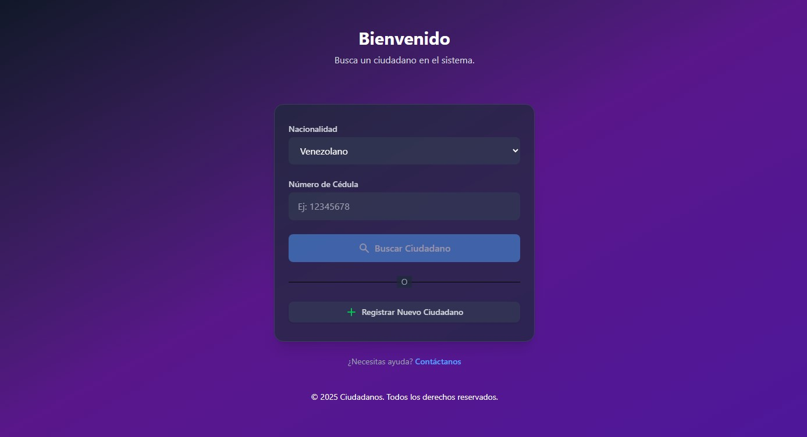
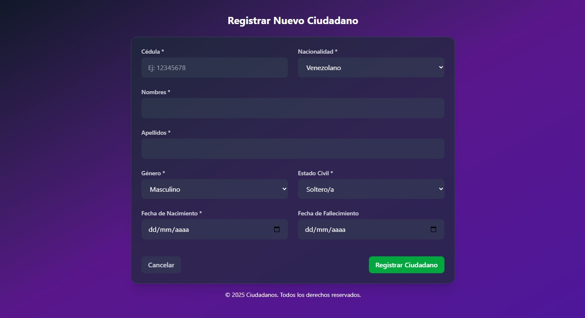
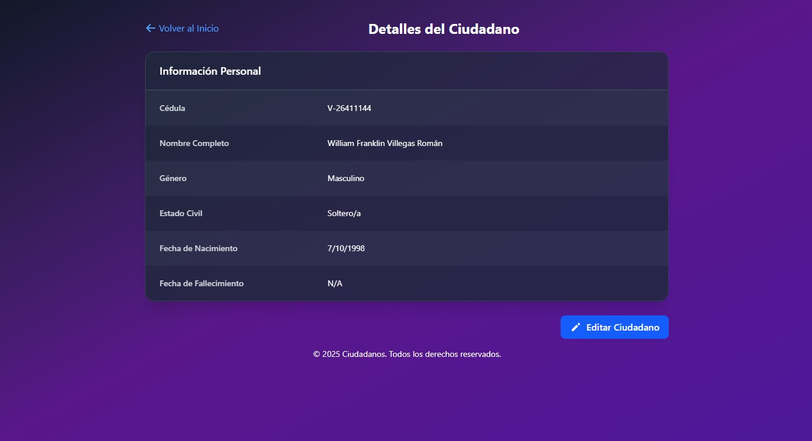
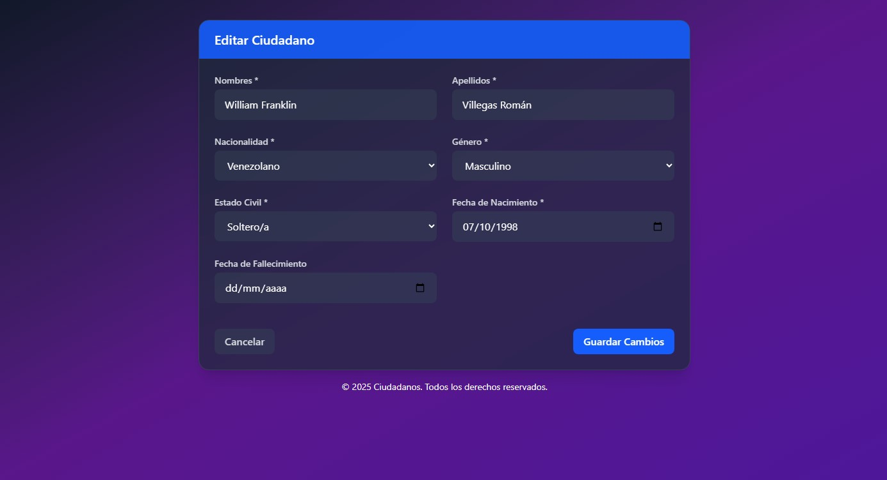
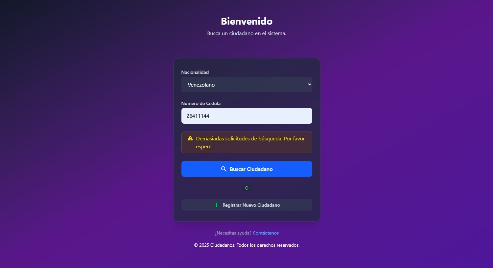
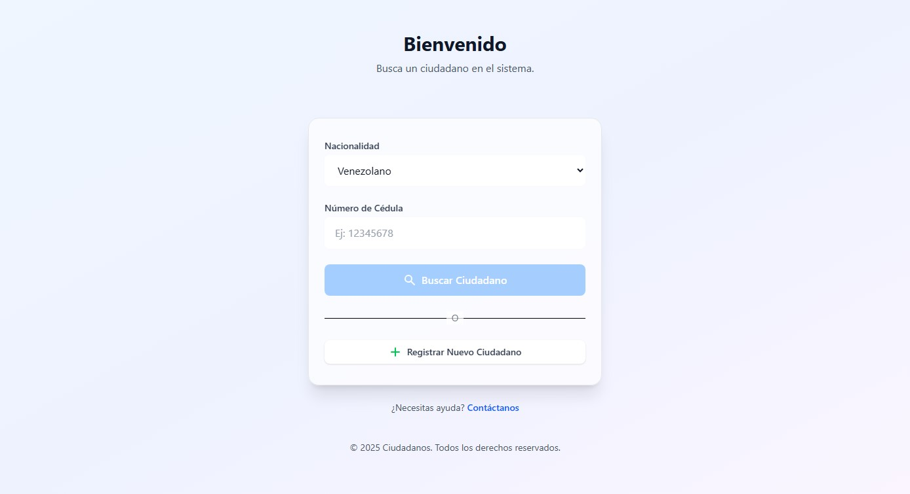

# Ciudadanos 🧑‍🤝‍🧑🇻🇪


> Web application for registering, querying, and updating citizens in a PostgreSQL database.  
> Originally developed for the Venezuelan Institute of Social Security (IVSS) using Oracle, this version has been adapted with a new structure for PostgreSQL.

---

## 📁 Project Structure

```bash
Ciudadanos/
├── Ciudadanos-API/       # Laravel 10 Backend
│   ├── app/              # Application logic
│   ├── config/           # Configuration files
│   └── routes/           # API route definitions
│
└── Frontend/             # React.js Frontend
    ├── public/           # Static assets
    ├── src/              # Source code
    └── package.json      # Dependencies
```

---

## ⚙️ Technologies Used

- **Laravel 10** – RESTful API for handling CRUD operations on citizens.
- **React.js 19.1** – Modern and fast UI for user interaction.
- **Tailwind CSS 4.1.7** – Styling with responsive support and dark/light theme.
- **PostgreSQL** – Robust and scalable database engine.


  

---

## 🧑‍💻 Features

✅ Register new citizens  
✅ View citizen information  
✅ Update citizen information  
✅ Responsive interface with dark and light mode support  
✅ Full integration between frontend and backend via REST API  
✅ Rate Limiting to protect against abuse via request limits

---

## 📸 Screenshots

<p><em>Preview of the main screens of the application:</em></p>

<p><strong>📋 Home Page</strong></p>
<p align="center">
  
</p>

<p><strong>➕ Citizen Registration</strong></p>
<p align="center">
  
</p>

<p><strong>📄 Citizen Details</strong></p>
<p align="center">
  
</p>

<p><strong>🔄 Update Citizen</strong></p>
<p align="center">
  
</p>

<p><strong>⛔ Rate Limiting Error</strong></p>
<p align="center">
  
</p>

<p><strong>☀ Light Mode</strong></p>
<p align="center">
  
</p>

---

## 🚀 Installation & Running

### 🔧 Backend (Laravel)

```bash
cd Ciudadanos/Ciudadanos-API
composer install
cp .env.example .env
php artisan key:generate
php artisan migrate --seed
php artisan serve
```

### 💻 Frontend (React.js)

```bash
cd Ciudadanos/Frontend
npm install
npm run dev
```

> Make sure the backend .env file is configured with your PostgreSQL database connection.

---

## 📡 API Endpoints

| Method | Route                | Description              |
|--------|----------------------|--------------------------|
| GET    | /api/ciudadanos      | Get all citizens |
| GET    | /api/ciudadanos/buscar | Search citizen by Nationality + ID Number |
| POST   | /api/ciudadanos      | Register a new citizen   |
| PATCH  | /api/ciudadanos/{ciudadano} | Update citizen  |

---

## 🧪 Testing

The system includes tests to verify endpoints and rate limiting:

```bash
php artisan test
```
Verified test cases:

✅ List citizens  
✅ Search citizen by ID number and nationality  
✅ Register new citizen  
✅ Update citizen  
✅ Request limit enforcement  
✅ Blocking after exceeding request limit  
✅ Reset after cooldown period  

---

## 📄 License

This project is a replica intended for testing and portfolio purposes.
It should not be used for commercial purposes without permission.

---

## 🙋‍♂️ Author

Developed by [William Villegas](https://www.linkedin.com/in/william-villegas-ab3b94215/)
