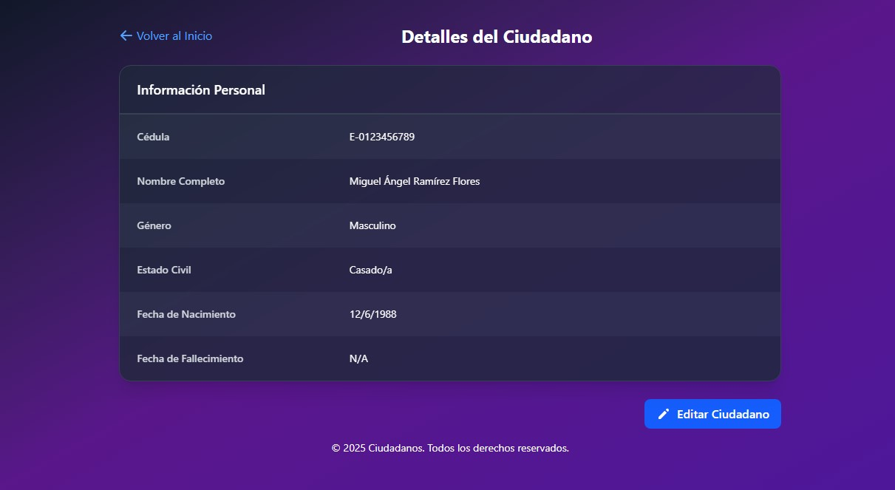

# Ciudadanos 🧑‍🤝‍🧑🇻🇪


> Aplicación web para el registro, consulta y actualización de Ciudadanos en una base de datos PostgreSQL.  
> Originalmente desarrollada para el Instituto Venezolano de los Seguros Sociales IVSS en Oracle, esta versión ha sido adaptada con una nueva estructura para PostgreSQL.

---

## 📁 Estructura del Proyecto

```bash
Ciudadanos/
├── Ciudadanos-API/       # Backend en Laravel 10
│   ├── app/              # Lógica de la aplicación
│   ├── config/           # Configuraciones
│   └── routes/           # Definición de endpoints
│
└── Frontend/             # Frontend en React.js
    ├── public/           # Assets estáticos
    ├── src/              # Código fuente
    └── package.json      # Dependencias
```

---

## ⚙️ Tecnologías Usadas

- **Laravel 10** – API RESTful para manejar operaciones CRUD de ciudadanos.
- **React.js 19.1** – Interfaz moderna y rápida para interacción del usuario.
- **Tailwind CSS 4.1.7** – Estilización con soporte responsive y modo oscuro/claro.
- **PostgreSQL** – Motor de base de datos robusto y escalable.


  

---

## 🧑‍💻 Funcionalidades

✅ Registrar nuevos ciudadanos  
✅ Consultar listado de ciudadanos  
✅ Actualizar datos de un ciudadano  
✅ Interfaz responsive con adaptación a tema oscuro y claro  
✅ Integración full entre Frontend y Backend mediante API REST
✅ Rate Limiting para limitar las consultas y operaciones dentro de la Aplicación

---

## 📸 Capturas de Pantalla

<p><em>Vista previa de las principales pantallas de la aplicación:</em></p>

<!-- Página de Inicio -->
<p><strong>📋 Página de Inicio</strong></p>
<p align="center">
  
</p>

<!-- Registro de Ciudadano -->
<p><strong>➕ Registro de Ciudadano</strong></p>
<p align="center">
  
</p>

<!-- Detalle de Ciudadano -->
<p><strong>📄 Detalle de Ciudadano</strong></p>
<p align="center">
  
</p>

<!-- Actualizar Ciudadano -->
<p><strong>🔄 Actualizar Ciudadano</strong></p>
<p align="center">
  
</p>

<!-- Rate Limiting Error -->
<p><strong>⛔ Error de Rate Limiting</strong></p>
<p align="center">
  
</p>

<!-- Modo Claro -->
<p><strong>🛠️ Modo Claro</strong></p>
<p align="center">
  
</p>

---

## 🚀 Instalación y Ejecución

### 🔧 Backend (Laravel)

```bash
cd Ciudadanos/Ciudadanos-API
composer install
cp .env.example .env
php artisan key:generate
php artisan migrate --seed
php artisan serve
```

### 💻 Frontend (React.js)

```bash
cd Ciudadanos/Frontend
npm install
npm run dev
```

> Asegúrate de que el archivo `.env` del backend tenga configurada la conexión a tu base de datos PostgreSQL.

---

## 📡 API Endpoints

| Método | Ruta                 | Descripción              |
|--------|----------------------|--------------------------|
| GET    | /api/ciudadanos      | Obtener todos los ciudadanos |
| GET    | /api/ciudadanos/buscar | Buscar ciudadano por Nacionalidad + Cédula |
| POST   | /api/ciudadanos      | Registrar ciudadano   |
| PATCH  | /api/ciudadanos/{ciudadano} | Actualizar ciudadano  |

---

## 🧪 Pruebas

> *(Si implementaste pruebas, aquí puedes detallar cómo ejecutarlas. Si no, te recomiendo agregarlas con Pest o PHPUnit para Laravel, y Vitest o Jest para React.)*

---

## 📄 Licencia

Este proyecto es una réplica con fines de prueba y de portafolio. No debe utilizarse con fines comerciales sin autorización.

---

## 🙋‍♂️ Autor

Desarrollado por [William Villegas](https://www.linkedin.com/in/william-villegas-ab3b94215/)
